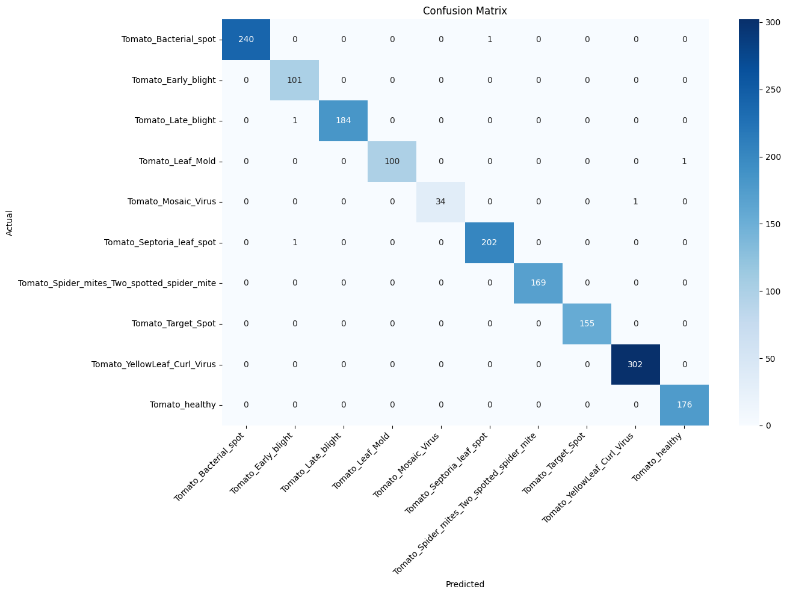
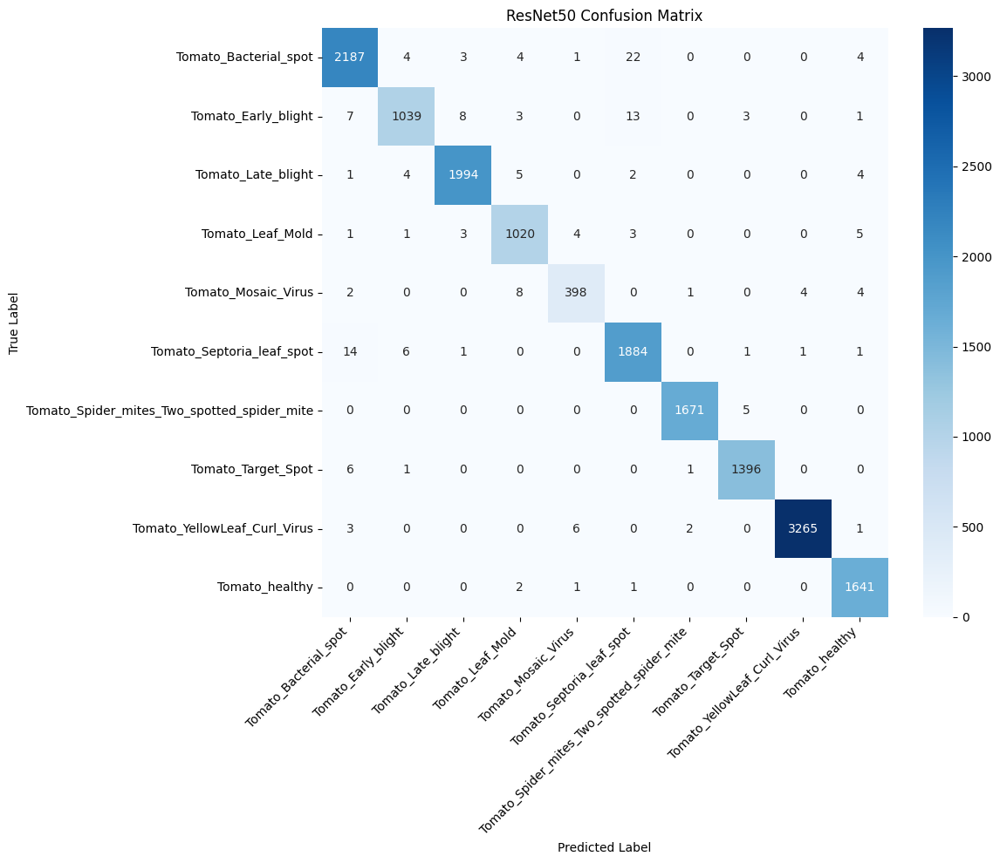

# Plant Leaf Disease Detection With Machine Learning

## Introduction

Plant diseases can significantly reduce crop yield and quality, making early detection important for effective crop management. This project focuses on automatically identifying tomato leaf diseases using deep learning techniques.

Two convolutional neural network models, ResNet-50 and EfficientNet-B0, were trained to classify tomato leaf images into 10 different categories, including several disease types and healthy leaves. The models were trained on a combined dataset of publicly available tomato leaf disease images and evaluated using standard classification metrics.

The goal of this project is to develop an accurate image-based classification system that can help detect plant diseases efficiently.

## Dataset

The dataset used for training is a mixture of publicly available tomato leaf disease datasets, including images similar to those in the PlantVillage dataset. The images were organized into 10 disease categories for classification.

| Property          | Value                                 |
| ----------------- | ------------------------------------- |
| Task              | Multi-class image classification      |
| Number of Classes | 10                                    |
| Total Test Images | 1668                                  |
| Image Type        | RGB leaf images                       |
| Data Split        | 80% Train / 10% Validation / 10% Test |
| Classes           | Tomato diseases + healthy             |

### Classes:

- Tomato_Bacterial_spot
- Tomato_Early_blight
- Tomato_Late_blight
- Tomato_Leaf_Mold
- Tomato_Septoria_leaf_spot
- Tomato_Spider_mites
- Tomato_Target_Spot
- Tomato_YellowLeaf_Curl_Virus
- Tomato_Mosaic_Virus
- Tomato_healthy

### Models Used

This project evaluates two deep learning architectures for tomato leaf disease classification:

- ResNet-50
- EfficientNet-B0

Both models were fine-tuned for multi-class classification of tomato leaf diseases.

---

## Model 1: EfficientNet-B0

### Model Training Parameters

| Parameter          | Value                                                    |
| ------------------ | -------------------------------------------------------- |
| Model Architecture | EfficientNet-B0                                          |
| Input Image Size   | 224 × 224                                                |
| Batch Size         | 32                                                       |
| Epochs             | 12                                                       |
| Optimizer          | AdamW                                                    |
| Learning Rate      | 3e-4                                                     |
| Weight Decay       | 1e-4                                                     |
| Loss Function      | CrossEntropyLoss                                         |
| LR Scheduler       | CosineAnnealingLR                                        |
| Training Split     | 80%                                                      |
| Validation Split   | 10%                                                      |
| Test Split         | 10%                                                      |
| Data Augmentation  | RandomResizedCrop, HorizontalFlip, Rotation, ColorJitter |
| Normalization      | ImageNet mean/std                                        |

### Model Performance Metrics (Classification Report on Test Set)

| Class                                       | Precision | Recall | F1 Score   | Support  |
| ------------------------------------------- | --------- | ------ | ---------- | -------- |
| Tomato_Bacterial_spot                       | 1.0000    | 0.9959 | 0.9979     | 241      |
| Tomato_Early_blight                         | 0.9806    | 1.0000 | 0.9902     | 101      |
| Tomato_Late_blight                          | 1.0000    | 0.9946 | 0.9973     | 185      |
| Tomato_Leaf_Mold                            | 1.0000    | 0.9901 | 0.9950     | 101      |
| Tomato_Mosaic_Virus                         | 1.0000    | 0.9714 | 0.9855     | 35       |
| Tomato_Septoria_leaf_spot                   | 0.9951    | 0.9951 | 0.9951     | 203      |
| Tomato_Spider_mites_Two_spotted_spider_mite | 1.0000    | 1.0000 | 1.0000     | 169      |
| Tomato_Target_Spot                          | 1.0000    | 1.0000 | 1.0000     | 155      |
| Tomato_YellowLeaf_Curl_Virus                | 0.9967    | 1.0000 | 0.9983     | 302      |
| Tomato_healthy                              | 0.9944    | 1.0000 | 0.9972     | 176      |
| **Accuracy**                                |           |        | **0.9970** | **1668** |
| **Macro Avg**                               | 0.9967    | 0.9947 | 0.9957     | 1668     |
| **Weighted Avg**                            | 0.9970    | 0.9970 | 0.9970     | 1668     |

### Confusion Matrix



### Overall Model 1 Performance (Test Set)

| Metric    | Score  |
| --------- | ------ |
| Accuracy  | 0.9970 |
| Precision | 0.9970 |
| Recall    | 0.9970 |
| F1 Score  | 0.9970 |

---

## Model 2: ResNet-50

### Model Performance Metrics (Classification Report on Test Set)

| Class                                       | Precision | Recall | F1 Score   | Support   |
| ------------------------------------------- | --------- | ------ | ---------- | --------- |
| Tomato_Bacterial_spot                       | 0.9847    | 0.9829 | 0.9838     | 2225      |
| Tomato_Early_blight                         | 0.9848    | 0.9674 | 0.9760     | 1074      |
| Tomato_Late_blight                          | 0.9925    | 0.9920 | 0.9923     | 2010      |
| Tomato_Leaf_Mold                            | 0.9789    | 0.9836 | 0.9812     | 1037      |
| Tomato_Mosaic_Virus                         | 0.9707    | 0.9544 | 0.9625     | 417       |
| Tomato_Septoria_leaf_spot                   | 0.9787    | 0.9874 | 0.9830     | 1908      |
| Tomato_Spider_mites_Two_spotted_spider_mite | 0.9976    | 0.9970 | 0.9973     | 1676      |
| Tomato_Target_Spot                          | 0.9936    | 0.9943 | 0.9939     | 1404      |
| Tomato_YellowLeaf_Curl_Virus                | 0.9985    | 0.9963 | 0.9974     | 3277      |
| Tomato_healthy                              | 0.9880    | 0.9976 | 0.9927     | 1645      |
| **Accuracy**                                |           |        | **0.9893** | **16673** |
| **Macro Avg**                               | 0.9868    | 0.9853 | 0.9860     | 16673     |
| **Weighted Avg**                            | 0.9893    | 0.9893 | 0.9893     | 16673     |

### Confusion Matrix



---

## Model Comparison

The following table summarizes the performance of both models on the test set:

| Model           | Accuracy | Precision | Recall | F1 Score |
| --------------- | -------- | --------- | ------ | -------- |
| ResNet-50       | 0.9893   | 0.9893    | 0.9893 | 0.9893   |
| EfficientNet-B0 | 0.9970   | 0.9970    | 0.9970 | 0.9970   |

**Observation:** EfficientNet-B0 slightly outperforms ResNet-50 across all metrics, showing its effectiveness for multi-class tomato leaf disease classification.

---

## Ensemble Method

To improve prediction robustness and overall classification performance, an ensemble approach was implemented by combining the outputs of two deep learning models: **ResNet-50** and **EfficientNet-B0**.

### 1. Weighted Soft Voting

Instead of using simple averaging, a **weighted soft voting strategy** was applied. Each model contributes to the final prediction based on its performance on the test dataset.

- EfficientNet-B0 demonstrated higher accuracy (~99.7%)
- ResNet-50 achieved slightly lower accuracy (~98.9%)

Based on this, higher weight was assigned to EfficientNet-B0:

- ResNet-50 weight: **0.3**
- EfficientNet-B0 weight: **0.7**

The final probability is computed as:

```math
P_{ensemble} = (0.3 \times P_{resnet}) + (0.7 \times P_{efficientnet})
```

---

### 2. Agreement-Based Confidence Boost

To further enhance reliability, an **agreement mechanism** was introduced:

- If both models predict the same top class, the ensemble confidence is slightly increased.
- This reflects higher certainty when both models agree on the prediction.

---

### 3. Confidence Thresholding (Unknown Detection)

To prevent incorrect predictions on irrelevant inputs (e.g., non-leaf images), a validation mechanism was added:

- Minimum confidence threshold: **60%**
- Minimum gap between top-1 and top-2 predictions: **10%**

If these conditions are not satisfied, the system rejects the prediction and labels it as uncertain.

---

### 4. Final Output

The system displays:

- Top-3 predictions for each model
- Top-3 predictions for the ensemble
- Final predicted class based on ensemble output

---

### Summary

The ensemble approach improves reliability by:

- Leveraging strengths of multiple models
- Reducing individual model bias
- Handling uncertain or invalid inputs effectively

This results in a more robust and practical plant disease detection system.
